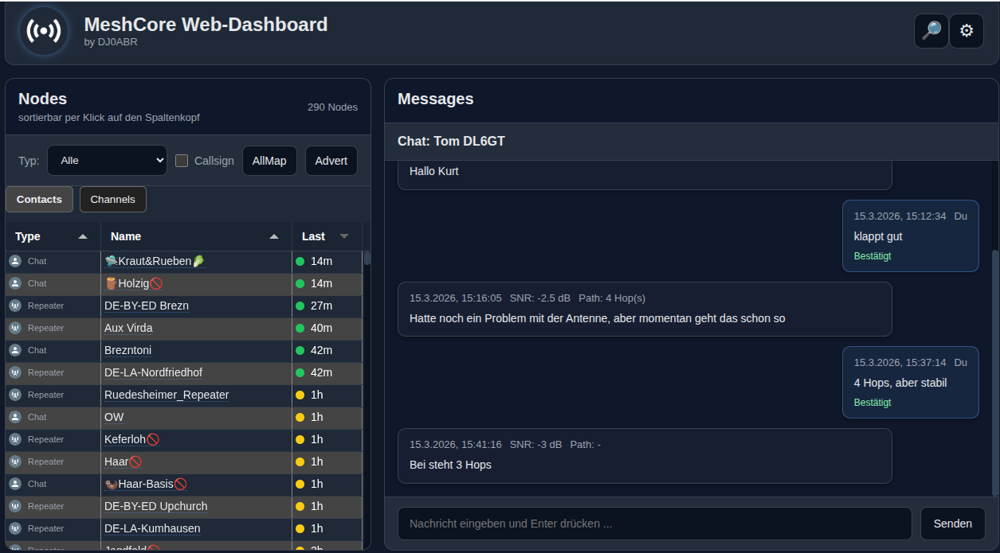
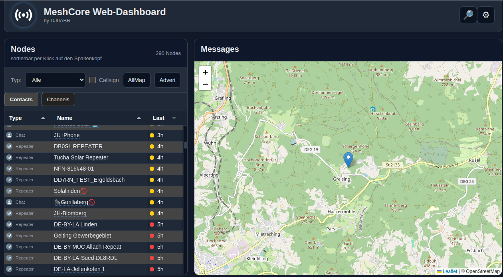
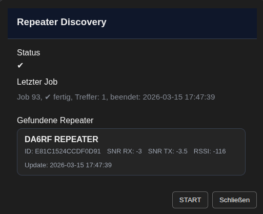
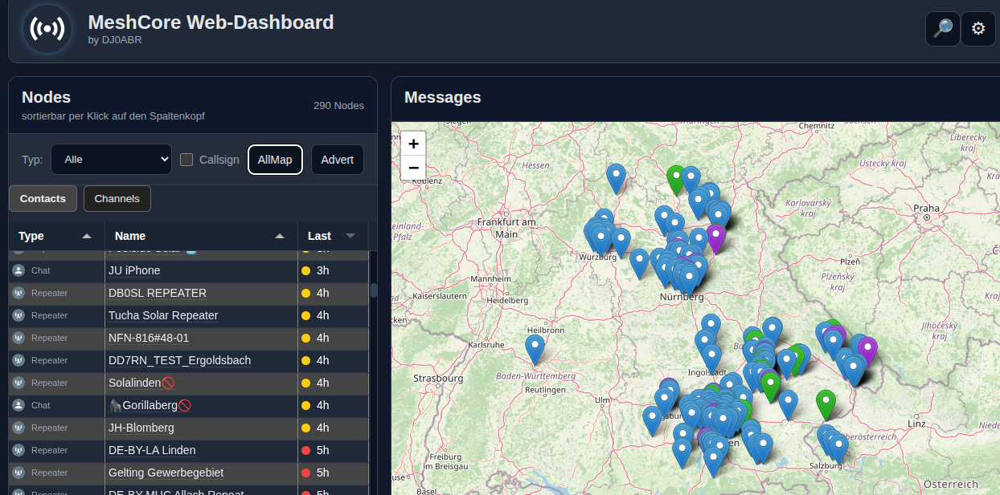
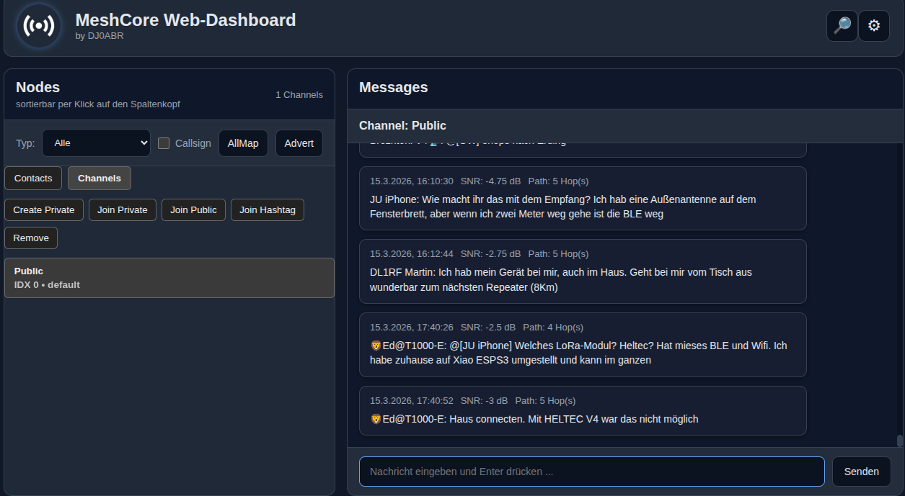
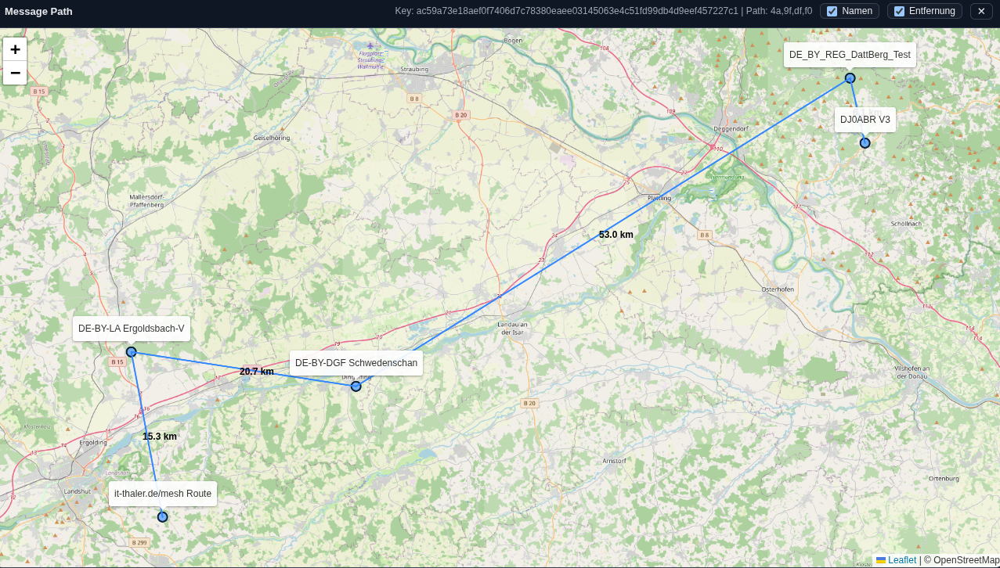

<p align="right">
  <a href="README.de.md">🇩🇪 Deutsch</a> |
  <a href="README.md">🇬🇧 English</a> |
  <a href="README.es.md">🇪🇸 Español</a> |
  <a href="README.fr.md">🇫🇷 Français</a> |
  <a href="README.it.md">🇮🇹 Italiano</a>
</p>

# MeshCore Web Dashboard

<sub>by DJ0ABR (c) 2026</sub>

Dashboard web per **nodi MeshCore** con particolare attenzione ai sistemi desktop.

-   funziona su **Linux** (Raspberry Pi, PC, ecc.)
-   **nessuno smartphone richiesto**
-   ottimizzato per **monitor desktop**
-   accessibile con **qualsiasi browser moderno** nella rete locale

------------------------------------------------------------------------

# Funzionalità

Il dashboard offre, tra le altre cose:

-   visualizzazione di **nodi e room**
-   **messaggi di chat**
-   **gestione dei canali**
-   **ricerca dei repeater**
-   **vista mappa** dei nodi

------------------------------------------------------------------------

## Screenshot

<p align="center">



</p>

<p align="center">



</p>

------------------------------------------------------------------------

# Preparare l'hardware

1. Apri il **WebFlasher** sul sito web di MeshCore.
2. Esegui il flash del pacchetto `Companion-USB`.

------------------------------------------------------------------------

# Installazione

Clonare il repository:

``` bash
git clone https://github.com/USER/meshcore-webdashboard.git
cd meshcore-webdashboard
```

Installare i pacchetti:

``` bash
sudo ./install.sh
```

------------------------------------------------------------------------

# Preparare il database

Avvia MariaDB:

``` bash
sudo mariadb
```

Inserisci il seguente blocco SQL:

``` sql
DROP USER IF EXISTS 'meshcore'@'localhost';
CREATE DATABASE IF NOT EXISTS meshcore
CHARACTER SET utf8mb4
COLLATE utf8mb4_general_ci;
CREATE USER 'meshcore'@'localhost';
GRANT ALL PRIVILEGES ON meshcore.* TO 'meshcore'@'localhost';
FLUSH PRIVILEGES;
```

------------------------------------------------------------------------

# Compilare il software

Compilare tutto:

``` bash
make
```

Installare i file HTML:

``` bash
sudo cp -R html/* /var/www/html
```

------------------------------------------------------------------------

# Avviare il programma

Collega l'hardware tramite USB.

Individua la porta seriale:

``` bash
ls /dev/tty*
```

Esempi:

Se la porta è **ttyUSB0**:

``` bash
./meshcore_api
```

Se la porta è **ttyACM0**:

``` bash
./meshcore_api /dev/ttyACM0
```

------------------------------------------------------------------------

# Aprire il dashboard

Nel browser all'interno della rete domestica:

    http://IP_del_Raspberry_Pi

------------------------------------------------------------------------

# Prima configurazione

1.  Fai clic sull'**icona a forma di ingranaggio** in alto a destra.
2.  Nella finestra di configurazione, inserisci i seguenti dati:

-   **Nome** (spazi e caratteri speciali consentiti)
-   **Longitudine**
-   **Latitudine**

3.  Fai clic su **Apply**.

------------------------------------------------------------------------

# Funzionamento

Il dashboard è ora pronto all'uso.

Quando vengono ricevute stazioni, queste compaiono nella **lista dei nodi
sul lato sinistro**.

⚠️ Nota:  
Potrebbe volerci **un'ora o più** prima che compaiano i primi nodi.

## Uso

- **Clic destro su un nodo:**  
  Si apre una **mappa con la posizione** del nodo.

- **Clic sinistro su una chat o room:**  
  Si apre la **finestra della chat**.

------------------------------------------------------------------------

# Repeater Discovery

Per cercare repeater MeshCore:

1.  Fai clic sull'**icona della lente** in alto a destra.
2.  Si apre la finestra **Repeater Discovery**.
3.  Fai clic su **START**.

Verranno cercati i repeater raggiungibili.\
Il processo può essere **eseguito più volte**.

------------------------------------------------------------------------

## License

This project is licensed under the MIT License.

This project is not affiliated with the MeshCore project.
